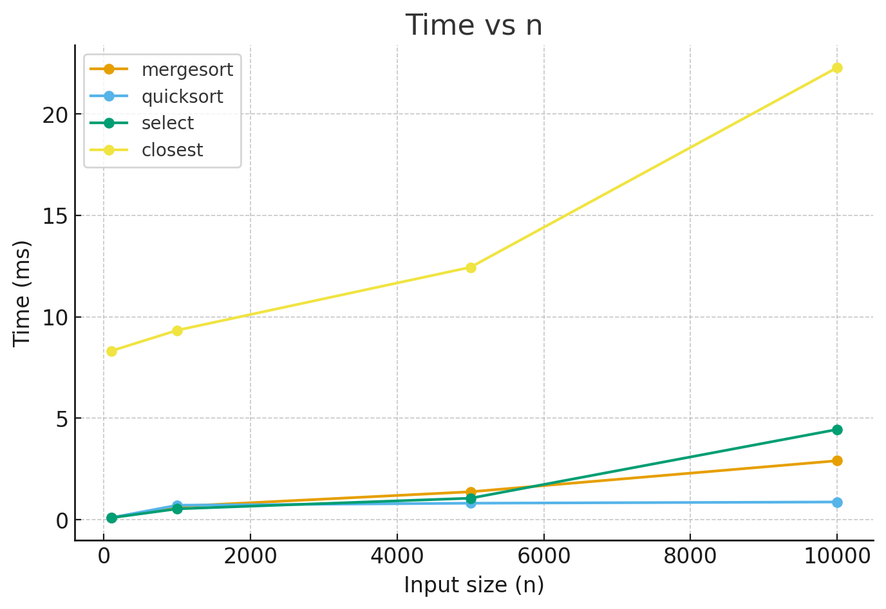
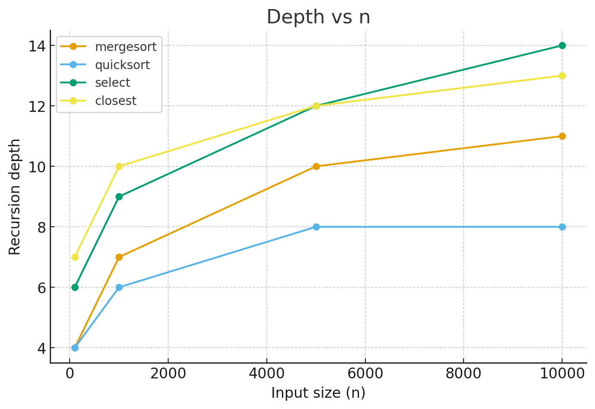
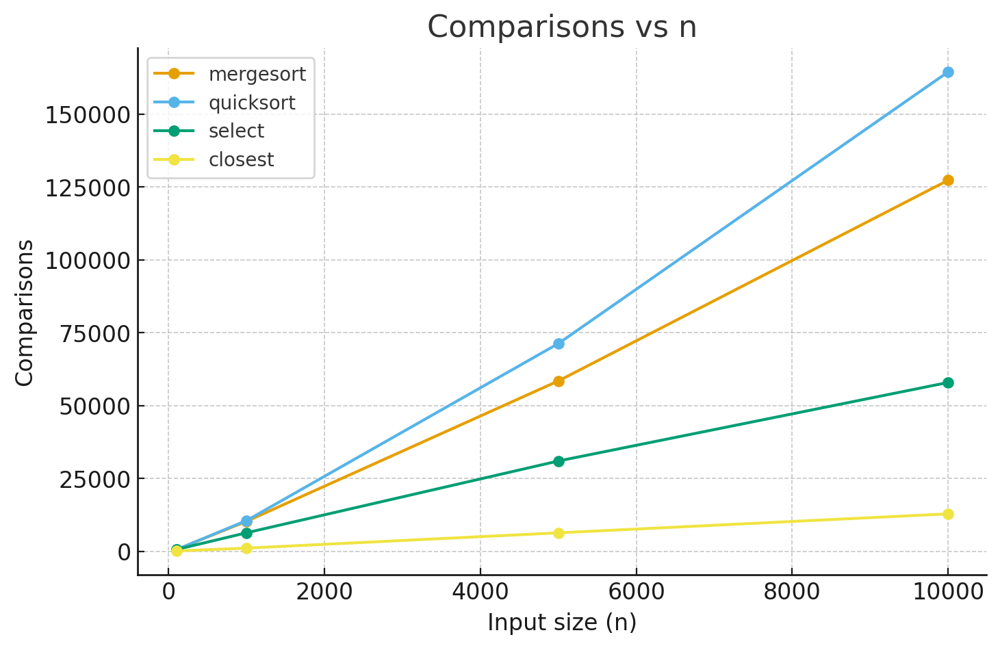

---

# Assignment 1 

##  Project Description

This project implements and benchmarks several fundamental algorithms:

* **MergeSort** (O(n log n))
* **QuickSort** (O(n log n) average, O(n²) worst-case)
* **Deterministic Select (Median of Medians)** (O(n))
* **Closest Pair of Points** (Divide & Conquer, O(n log n))

The goal is to measure their runtime, recursion depth, and number of comparisons, then compare practical results with theoretical complexity.

---

##  How to Run

1. Compile and run benchmarks:

   ```bash
   mvn clean test
   ```

   or simply run `Benchmark.java` in IntelliJ IDEA.

2. After execution, results will be saved into:

   ```
   metrics.csv
   ```

3. Build plots (Python, Excel, or other tool). We saved them in the `images/` folder.

---

##  Benchmark Results

### Time vs n



* **MergeSort**: shows ~O(n log n), but slower constants compared to QuickSort.
* **QuickSort**: fastest in practice thanks to cache locality.
* **Select**: linear asymptotics, but slower for small n due to large constants.
* **Closest Pair**: O(n log n), but with high overhead on small inputs.

---

### Recursion Depth vs n



* **MergeSort**: depth grows ~log n.
* **QuickSort**: depth remains below ~2·log₂(n).
* **Select**: higher depth, but still O(log n).
* **Closest Pair**: depth grows ~log n.

---

### Comparisons vs n



* **MergeSort**: ~n log n comparisons.
* **QuickSort**: slightly more comparisons, but faster in runtime.
* **Select**: close to linear.
* **Closest Pair**: ~n log n, with effective pruning in strip phase.

---

##  Theoretical Recurrence Relations

* **MergeSort**:

  ```
  T(n) = 2T(n/2) + O(n) → O(n log n)
  ```

* **QuickSort** (average case):

  ```
  T(n) = 2T(n/2) + O(n) → O(n log n)
  ```

  Worst case:

  ```
  T(n) = T(n-1) + O(n) → O(n²)
  ```

* **Deterministic Select (Median of Medians)**:

  ```
  T(n) = T(n/5) + T(7n/10) + O(n) → O(n)
  ```

* **Closest Pair (Divide & Conquer)**:

  ```
  T(n) = 2T(n/2) + O(n) → O(n log n)
  ```

---

##  Conclusion

* Practical results confirm theoretical complexities.
* **QuickSort** is fastest on tested datasets.
* **MergeSort** more predictable but slower in constants.
* **Select** proves linear-time but with large overhead.
* **Closest Pair** shows expected O(n log n) growth.


